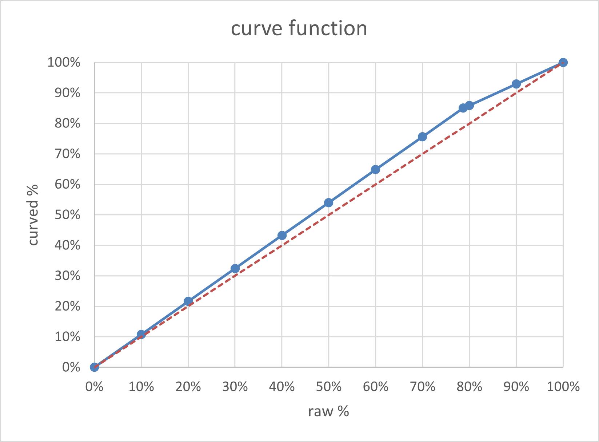

# Explanation of Exam 2 curving

The grade written on your exam consists of a _raw score_ out of 75, converted to a _raw percentage_ followed by a _curved percentage_.

The curve was a piecewise linear function with the following properties: 0% maps to 0%,  78.7% maps to 85.0%, 100% maps to 100%. These values were chosen so that the raw median of 78.7% would map to a B grade (85%, a fair reflection of achievements of the median student). 

Here's a graph of this function:
