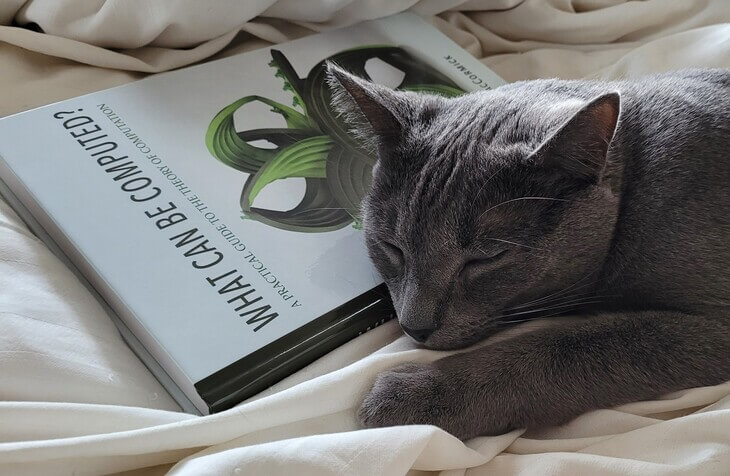

# COMP/MATH314: Computability and Complexity, Spring 2023

* [Syllabus](syllabus-1-23-2023.docx)
* [Overview Schedule](schedule-1-23-2023.xlsx)  <!-- &nbsp;&nbsp;&nbsp;UPDATED on 9/18/2022 -->
* [Detailed schedule](resources)
* [Textbook (WCBC)](textbook.md)
* [Homework assignments](hw)
* [QRA](qra.md)
* [Exams](exams.md)&nbsp;&nbsp;&nbsp;UPDATED on 5/2/2023
* [Moodle](https://lms.dickinson.edu/course/view.php?id=49026)
* [Python
programs](http://whatcanbecomputed.com/wp-content/uploads/2019/01/wcbc-programs-v1.1.zip)
from [whatcanbecomputed.com](https://whatcanbecomputed.com/) (ignore security warnings; also available on [Moodle](https://lms.dickinson.edu/mod/resource/view.php?id=1167805))

----
Last modified: Tue May 02 12:52:27 UTC 2023 by jmac.
